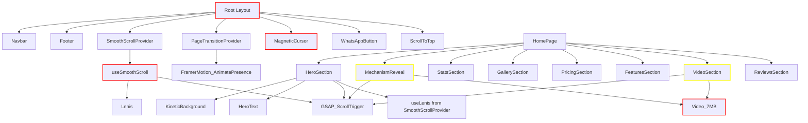

# Wasleen — PageSpeed & Mobile Exception Remediation Plan

**Based on:** [`plans/pagespeed-insights-report.md`](plans/pagespeed-insights-report.md)
**Audit Date:** May 3, 2026
**Scores:** Performance 79/87 (M/D), Accessibility 73/86, Best Practices 96/100, SEO 92/100

---

## 🚨 DIAGNOSIS SUMMARY

### Issue A: Mobile Client-Side Exception (Black Screen)

**Symptom:** `"Application error: a client-side exception has occurred"` with full black screen on mobile. Lighthouse captured `<html id="__next_error__">` in accessibility audit.

**Root Cause Analysis:**

| Factor | Finding |
|--------|---------|
| Error Page | Next.js default error boundary rendered (`__next_error__` id) |
| Console Error | `Minified React error #300` (hydration mismatch in React 19) |
| Source | `chunks/4bd1b696-c023c6e3521b1417.js:1:51267` |
| Missing Files | No [`src/app/error.tsx`](src/app) or [`src/app/global-error.tsx`](src/app) — so Next.js uses its bare-minimum default error page (no `<html lang="">`, no `<main>` landmark) |
| Intermittent | The Performance report shows a successful load — error happens on some mobile loads only |

**Most Likely Triggers (race condition / timing):**

1. **Lenis smooth scroll** ([`src/hooks/useSmoothScroll.ts`](src/hooks/useSmoothScroll.ts:57-64)) initialises on all devices including mobile. The `touchMultiplier: 1.2` + `smoothWheel: true` can conflict with mobile browser touch scroll, throwing during Lenis constructor or scroll event binding on certain mobile browsers.

2. **GSAP ScrollTrigger + mobile viewport** ([`src/components/homepage/HeroSection.tsx`](src/components/homepage/HeroSection.tsx:53-56)) — the `ScrollTrigger.create` with `pin: true` and `end: '+=300'` can cause calculation errors on mobile viewports where the virtual scroll space differs.

3. **Video autoplay attempt** ([`src/components/homepage/MechanismReveal.tsx`](src/components/homepage/MechanismReveal.tsx:36-38)) — `videoRef.current.play().catch(() => {})` swallows errors but the act of calling `.play()` can trigger browser intervention on mobile, potentially cascading.

4. **MagneticCursor DOM mutation** ([`src/components/ui/MagneticCursor.tsx`](src/components/ui/MagneticCursor.tsx:267-268)) — injects `* { cursor: none !important; }` on first render, then removes it on re-render when `isTouchDevice` flips to `true`. This DOM structure change during hydration can trigger React error #300.

**Primary Fix:** Add custom [`src/app/error.tsx`](src/app) and [`src/app/global-error.tsx`](src/app) to gracefully catch errors, plus fix the root causes above.

---

### Issue B: Performance (79 Mobile / 87 Desktop)

| Metric | Mobile | Target | Gap |
|--------|--------|--------|-----|
| FCP | 1.1s | <1.0s | +0.1s |
| **LCP** | **4.5s** | **<2.5s** | **+2.0s** |
| TBT | 230ms | <200ms | +30ms |
| SI | 3.5s | <3.0s | +0.5s |
| CLS | 0 | <0.1 | ✅ |

**Key Bottlenecks Identified:**

1. **🔴 Two autoplay videos (~15.1 MB total)** — [`MechanismReveal`](src/components/homepage/MechanismReveal.tsx:91-102) loads `foldable-garage-mechanism-video.mp4` (7.7 MB) with `preload="auto"` + `autoPlay`. [`VideoSection`](src/components/homepage/VideoSection.tsx:100-110) loads the second video (7.4 MB). Combined they're ~88% of total page weight.

2. **🔴 Images oversized (891–975 KiB savings)** — Hero image at 198 KiB and feature images at 145–242 KiB are too large for their display size.

3. **🟠 Forced reflow in chunk 535 (~919ms)** — Likely from GSAP/Lenis accessing `offsetWidth`/`offsetHeight` during scroll-driven animations.

4. **🟠 LCP Render Delay (2,160ms)** — Hero image discovery is delayed, likely by render-blocking CSS and JS execution.

5. **🟠 Render-blocking CSS (450ms savings)** — Two CSS files cascade.

6. **🟠 GTM unused JS (71.8 KiB waste)** — GTM container loads but much code is unused on initial page.

7. **🟡 Legacy JS polyfills (11.5 KiB)** — `Array.prototype.at`, `.flat`, `.flatMap`, `Object.fromEntries`, etc.

8. **🟡 DOM size (753 elements)** — Relatively large for a single-page marketing site.

---

## 📋 ACTION PLAN

### Phase 1: Fix Mobile Crash (P0 — Immediate)

| # | Action | File(s) | What To Do |
|---|--------|---------|------------|
| 1.1 | **Add `error.tsx`** | [`src/app/error.tsx`](src/app) (new) | Create a client error boundary that renders the Wasleen branded error page with proper `<html lang="en">`, main landmark, navigation back to home |
| 1.2 | **Add `global-error.tsx`** | [`src/app/global-error.tsx`](src/app) (new) | Create a global error boundary that catches root layout errors; includes basic inline styles since CSS won't load |
| 1.3 | **Wrap Lenis in try/catch** | [`src/hooks/useSmoothScroll.ts`](src/hooks/useSmoothScroll.ts:57-64) | Wrap `new Lenis(...)` in try/catch; on failure, silently fall back to native scroll. Add a `isTouchDevice` check before initialising Lenis |
| 1.4 | **Guard GSAP ScrollTrigger on mobile** | [`src/components/homepage/HeroSection.tsx`](src/components/homepage/HeroSection.tsx:43-56), [`MechanismReveal.tsx`](src/components/homepage/MechanismReveal.tsx:25-54), [`VideoSection.tsx`](src/components/homepage/VideoSection.tsx:24-62) | Wrap all `ScrollTrigger.create()` in try/catch blocks. Add `isTouchDevice` guard to skip ScrollTrigger pin/scrub on mobile |
| 1.5 | **Fix MagneticCursor hydration** | [`src/components/ui/MagneticCursor.tsx`](src/components/ui/MagneticCursor.tsx) | Move the `* { cursor: none !important; }` style injection to after hydration confirms non-touch device. Use `useEffect` to add style dynamically rather than inline render |
| 1.6 | **Guard MechanismReveal video** | [`src/components/homepage/MechanismReveal.tsx`](src/components/homepage/MechanismReveal.tsx:36-38) | Remove the bare `.play().catch(() => {})` — use `onCanPlayThrough` event to trigger play, and check `navigator.userActivation` before attempting autoplay on mobile |

### Phase 2: Video Optimization (P0 — Critical for LCP)

| # | Action | File(s) | What To Do |
|---|--------|---------|------------|
| 2.1 | **Mechanism video → poster + lazy** | [`src/components/homepage/MechanismReveal.tsx`](src/components/homepage/MechanismReveal.tsx:91-102) | Change `preload="auto"` to `preload="none"` or `preload="metadata"`. Remove `autoPlay` — only start playing when section enters viewport (use IntersectionObserver). Add a static poster image that loads via `next/image` |
| 2.2 | **VideoSection video → lazy** | [`src/components/homepage/VideoSection.tsx`](src/components/homepage/VideoSection.tsx:100-110) | Same treatment: `preload="none"`, only start loading when section scrolls into view |
| 2.3 | **Add video size constraints** | [`next.config.ts`](next.config.ts) | Add a note/documentation that videos should be compressed. Recommended: compress both videos to under 5 MB each using HandBrake (H.264, CRF 23, 1080p, keyframe every 1s) |

### Phase 3: Image Optimization (P0 — Largest savings)

| # | Action | File(s) | What To Do |
|---|--------|---------|------------|
| 3.1 | **Enable `next/image` optimization** | [`next.config.ts`](next.config.ts:5) | **Change `images.unoptimized: true` to `false`** (or remove the line). This is currently disabling all Next.js image optimization — the #1 cause of oversized images. Let Next.js auto-optimize to WebP/AVIF at appropriate sizes |
| 3.2 | **Add proper `sizes` attributes** | All `Image` components: [`HeroSection.tsx`](src/components/homepage/HeroSection.tsx:93-100), [`StatsSection.tsx`](src/components/homepage/StatsSection.tsx:118-126), etc. | Ensure every `<Image>` has a correct `sizes` attribute that matches your CSS breakpoints |
| 3.3 | **Set explicit width/height** | All `Image` components using `fill` prop | Where using `fill`, ensure parent element has explicit `position: relative` and dimensions. For hero image, provide `width`/`height` and use `sizes` for responsive |
| 3.4 | **Compress images at source** | Manual action (you) | Run all WebP images through `sharp` or `imagemagick` to reduce quality to 70-80%. Target sizes: Hero <100 KiB, Feature cards <120 KiB each, Swatches <80 KiB each |

### Phase 4: CSS & Rendering Optimization (P1 — High)

| # | Action | File(s) | What To Do |
|---|--------|---------|------------|
| 4.1 | **Inline critical CSS** | [`src/app/layout.tsx`](src/app/layout.tsx) | Extract critical above-the-fold CSS (hero section styles) and inline them in a `<style>` tag in `<head>`. This eliminates render-blocking CSS for initial viewport |
| 4.2 | **Remove unused CSS** | [`src/app/globals.css`](src/app/globals.css) | Audit global CSS — remove animation keyframes and utility classes not used above the fold. Move non-critical animations (brochure, glassmorphism, spec borders) to lazy-loaded CSS or component-level styles |
| 4.3 | **Preload hero image** | [`src/app/layout.tsx`](src/app/layout.tsx) | Add `<link rel="preload" as="image" href="/images/...hero-image.webp">` in `<head>` to ensure the LCP element is discovered early |
| 4.4 | **Add `fetchpriority="high"`** | [`src/components/homepage/HeroSection.tsx`](src/components/homepage/HeroSection.tsx:93-100) | The hero Image already has `priority` — also add `fetchPriority="high"` attribute for explicit LCP hint |

### Phase 5: JavaScript Optimization (P1 — High)

| # | Action | File(s) | What To Do |
|---|--------|---------|------------|
| 5.1 | **Lazy-load heavy components** | [`src/app/page.tsx`](src/app/page.tsx) | Use `next/dynamic` with `ssr: false` for: [`MechanismReveal`](src/components/homepage/MechanismReveal.tsx), [`VideoSection`](src/components/homepage/VideoSection.tsx), [`KineticBackground`](src/components/homepage/KineticBackground.tsx), [`MagneticCursor`](src/components/ui/MagneticCursor.tsx), [`StatsSection`](src/components/homepage/StatsSection.tsx). These are below the fold or not needed immediately |
| 5.2 | **Defer GTM initialization** | [`src/app/layout.tsx`](src/app/layout.tsx:68-76) | Change GTM script from sync to async/deferred. Consider using `next/script` with `strategy="afterInteractive"` or `strategy="lazyOnload"` instead of inline `<script>` |
| 5.3 | **Reduce framer-motion bundle** | Various | Ensure `optimizePackageImports` in [`next.config.ts`](next.config.ts:8) includes `'framer-motion'` (already there). Verify tree-shaking works by auditing imports |
| 5.4 | **Fix forced reflow** | [`src/components/homepage/MechanismReveal.tsx`](src/components/homepage/MechanismReveal.tsx) | The forced reflow (919ms in chunk 535) is likely from `setProgress(self.progress)` calling `useState` and triggering re-render + layout on every scroll frame. Use `useRef` instead of `useState` for scroll progress, or throttle updates to every 100ms using `requestAnimationFrame` gap |
| 5.5 | **Defer non-critical JS** | [`src/app/layout.tsx`](src/app/layout.tsx:104-117) | Move [`MagneticCursor`](src/components/ui/MagneticCursor.tsx), [`WhatsAppButton`](src/components/layout/WhatsAppButton.tsx), [`ScrollToTop`](src/components/layout/ScrollToTop.tsx) to dynamic imports with `ssr: false` — they are floating UI elements not needed on initial load |

### Phase 6: Accessibility (P2 — Medium)

| # | Action | File(s) | What To Do |
|---|--------|---------|------------|
| 6.1 | **Add `<html lang="en">` to error boundary** | [`src/app/error.tsx`](src/app/error.tsx) (new) | Ensure the error page sets `lang="en"` on `<html>` |
| 6.2 | **Add `<main>` landmark to error page** | [`src/app/error.tsx`](src/app/error.tsx) (new) | Wrap error content in `<main>` element |
| 6.3 | **Add `role="alert"` to error message** | [`src/app/error.tsx`](src/app/error.tsx) (new) | For screen reader announcement |
| 6.4 | **Fix button accessible names** | Various | Add `aria-label` to icon-only buttons |
| 6.5 | **Add video captions track** | [`VideoSection.tsx`](src/components/homepage/VideoSection.tsx:100-110) | Add `<track kind="captions">` element |
| 6.6 | **Fix heading order** | Various | Ensure `h1 → h2 → h3` hierarchical order throughout pages |

### Phase 7: Security & SEO (P2 — Medium)

| # | Action | File(s) | What To Do |
|---|--------|---------|------------|
| 7.1 | **Add CSP headers** | [`next.config.ts`](next.config.ts) or Vercel config | Configure Content-Security-Policy header in `next.config.ts` headers() function or Vercel's `vercel.json` |
| 7.2 | **Add COOP & XFO headers** | [`next.config.ts`](next.config.ts) | Add `Cross-Origin-Opener-Policy: same-origin` and `X-Frame-Options: DENY` headers |
| 7.3 | **Add HSTS with preload** | [`next.config.ts`](next.config.ts) or Vercel | Add `Strict-Transport-Security: max-age=31536000; includeSubDomains; preload` header |
| 7.4 | **Fix `robots.txt`** | [`src/app/robots.ts`](src/app/robots.ts) | Ensure robots.txt returns valid content and is accessible |

### Phase 8: Manual Actions (You — Outside Code)

| # | Action | Details |
|---|--------|---------|
| 8.1 | **Re-compress videos** | Use HandBrake or FFmpeg to re-encode both MP4s: H.264, CRF 23-25, 1080p, target <5 MB each. Keyframe every 1s for scrub support |
| 8.2 | **Re-compress WebP images** | Run all images in [`public/images/`](public/images/) through `sharp` CLI or Squoosh: quality 70-80%. Hero image target <100 KiB, feature cards <120 KiB each |
| 8.3 | **Submit new sitemap to GSC** | After fixes, re-submit `sitemap.xml` to Google Search Console |
| 8.4 | **Test on real mobile devices** | Test on iPhone Safari, Chrome Android after each phase |

---

## 📊 EXPECTED IMPROVEMENT

| Metric | Before | After (Target) | Primary Fix |
|--------|--------|----------------|-------------|
| **LCP (Mobile)** | 4.5s | <2.5s | Enable image optimization + preload hero + defer videos |
| **FCP (Mobile)** | 1.1s | <0.8s | Inline critical CSS + preload hero image |
| **TBT (Mobile)** | 230ms | <100ms | Lazy-load components + defer GTM + fix forced reflow |
| **Performance Score** | 79 | 90+ | All of the above |
| **Accessibility** | 73 | 95+ | Error boundary + headings + ARIA |
| **Best Practices** | 96 | 100 | Headers + console errors fixed |
| **SEO** | 92 | 100 | robots.txt + error page |
| **Page Weight** | ~16.8 MB | <3 MB | Video + image optimization |

---

## ⚡ QUICK WINS (Can Be Done Simultaneously)

These are independent and can be worked on in parallel:

1. **`error.tsx` + `global-error.tsx`** — Fixes mobile black screen immediately
2. **`images.unoptimized: false`** in [`next.config.ts`](next.config.ts) — #1 image savings
3. **Lazy-load GSAP components** via `next/dynamic` in [`src/app/page.tsx`](src/app/page.tsx) — reduces main thread work
4. **Move GTM to `next/script`** with `afterInteractive` — reduces render blocking
5. **Try/catch Lenis & ScrollTrigger** — prevents crash cascade

---

## 🛡️ COMPONENT DEPENDENCY MAP

---

## 📝 PRIORITIZED TODO LIST FOR CODE MODE

### P0 — Must Fix (Mobile Crash)
- [ ] Create [`src/app/error.tsx`](src/app) — branded client error boundary
- [ ] Create [`src/app/global-error.tsx`](src/app) — global error boundary
- [ ] Add try/catch around Lenis init in [`useSmoothScroll.ts`](src/hooks/useSmoothScroll.ts)
- [ ] Add try/catch around all ScrollTrigger.create() calls in HeroSection, MechanismReveal, VideoSection
- [ ] Fix MagneticCursor style injection to avoid hydration mismatch

### P0 — Must Fix (Performance)
- [ ] Set `images.unoptimized: false` in [`next.config.ts`](next.config.ts)
- [ ] Add `<link rel="preload">` for hero image in layout
- [ ] Change MechanismReveal video to `preload="none"` + intersection observer
- [ ] Change VideoSection video to `preload="none"` + intersection observer
- [ ] Lazy-load MechanismReveal, VideoSection, KineticBackground, MagneticCursor via `next/dynamic`

### P1 — Should Fix
- [ ] Fix forced reflow in MechanismReveal (useRef instead of useState for progress)
- [ ] Move GTM script to `next/script` with `strategy="afterInteractive"`
- [ ] Add proper `sizes` attributes to all Image components
- [ ] Add security headers (CSP, COOP, XFO, HSTS) in next.config.ts
- [ ] Fix robots.txt

### P2 — Nice to Fix
- [ ] Add video captions track
- [ ] Fix heading hierarchy
- [ ] Add `aria-label` to icon-only buttons
- [ ] Re-compress videos & images (manual action)
